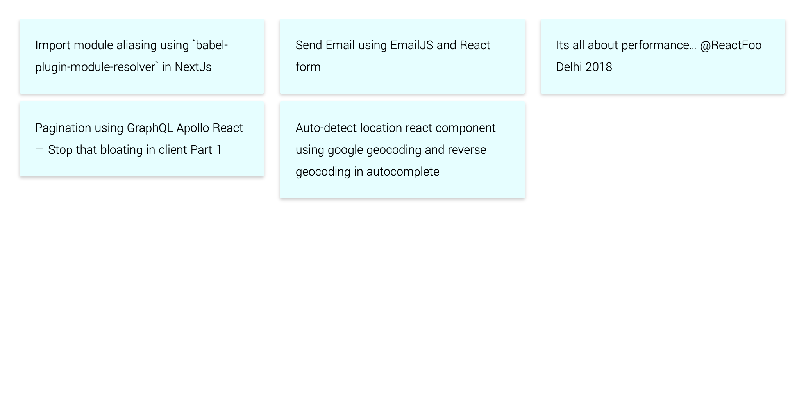

## About this

Create public api using Medium RSS feed, to fetch your articles and return JSON response

.

The api is at https://medium-posts-api.vercel.app/api/medium/posts

Demo: https://medium-posts-api.vercel.app/

## Getting Started

First, run the development server:

```bash
npm run dev
# or
yarn dev
```

Open [http://localhost:3000](http://localhost:3000) with your browser to see the result.

You can start editing the page by modifying `pages/index.js`. The page auto-updates as you edit the file.
